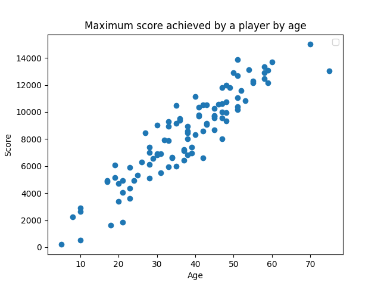
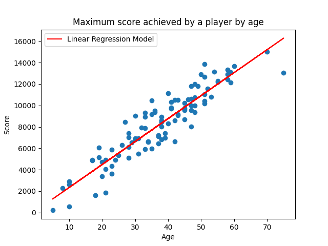

# **[El consumo no entiende de edades](https://immune.hackrocks.com/challenges/start/el-consumo-no-entiende-de-edades)**

| 60 Points | MEDIUM |
|---|---|

## **Summary**
¿Eres consciente de toda la información personal que una empresa puede descubrir sobre ti, sin que tú se la hayas dado, gracias a la inteligencia artificial? De hecho, ¿sabes que se puede ganar mucho dinero con ello? ¡Entra a descubrir cómo!

## In this challenge:
- Python, Machine Learning
- Data Analysis, Regresión Lineal

---

Durante el ciberataque, gran parte de las bases de datos de VR Electronics fueron eliminadas, incluyendo los perfiles de muchos usuarios de la plataforma gaming, lo que ha supuesto un duro golpe económico para la empresa. Estos perfiles eran muy útiles para determinar la colocación de publicidad, es decir, determinar qué anuncios personalizados debían mostrársele a cada jugador para maximizar nuestros beneficios.

Ahora no nos queda otra que comenzar a construir los perfiles de nuevo. Muchos de los datos de los perfiles no son proporcionados directamente por los usuarios, sino que son extraídos indirectamente gracias al análisis de datos utilizando Inteligencia Artificial.

En una encuesta reciente, se preguntó a 100 jugadores habituales del Space Invaders su edad y la puntuación más alta que habían conseguido en el juego. Los resultados de dicha encuesta aparecen representados en la gráfica:

Se observa a simple vista que los datos siguen una distribución lineal, por lo que se aplica un algoritmo de regresión lineal para obtener un modelo que relacione la edad de un jugador de Space Invaders con la puntuación máxima que ha obtenido. El resultado es el mostrado en la figura:

Este modelo se corresponde con una recta de pendiente = 214.81 y ordenada en el origen = 179.67.
Queremos utilizar el modelo para determinad la edad de los jugadores de Space Invaders en base a su puntuación máxima, y así determinar qué anuncios mostrarles con más frecuencia (Por ejemplo, a los jóvenes de Fornite. y a los ancianos, de fijadores para la dentadura postiza).

---

### **Situación inicial:**
Se suministra el script **[testModel.py](testModel.py)**, que solicita al usuario que introduzca la puntuación máxima obtenida por un jugador e imprime en consola la edad inferida de dicho jugador. Para ello, el script hace uso de la función [`infereAge`](testModel.py#L2). Dicha función debería ser capaz de, haciendo uso del modelo de regresión mencionado en el enunciado, estimar la edad de un jugador en base a su puntuación. El problema es que la función está incompleta.

---

### **Problema:**:
Completar la función [`infereAge`](testModel.py#L2) para que el script **[testModel.py](testModel.py)**, que infiere la edad de un jugador en base a su máxima puntuación, funcione correctamente. La edad devuelta debe estar redondeada. Al concursante se le proporciona el archivo **[Test_data.txt](Test_data.txt)** con ejemplos de entradas (puntuaciones) y salidas esperadas (edades), para que pueda evaluar su código.

---

### **Solución:**
La solución es el script **[testModel.py](testModel.py)** arreglado.

