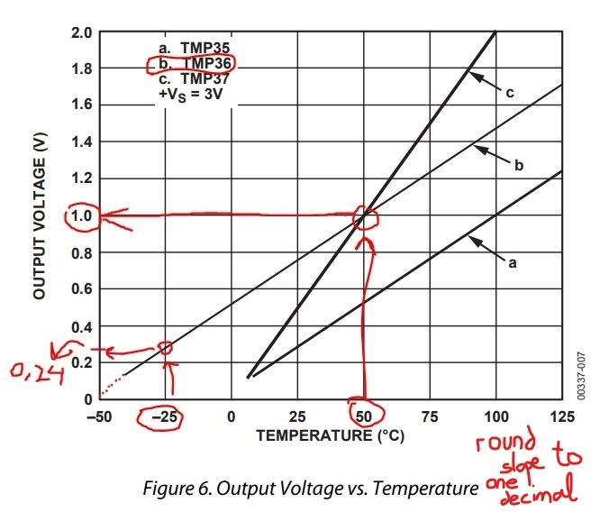
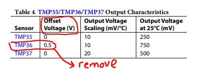
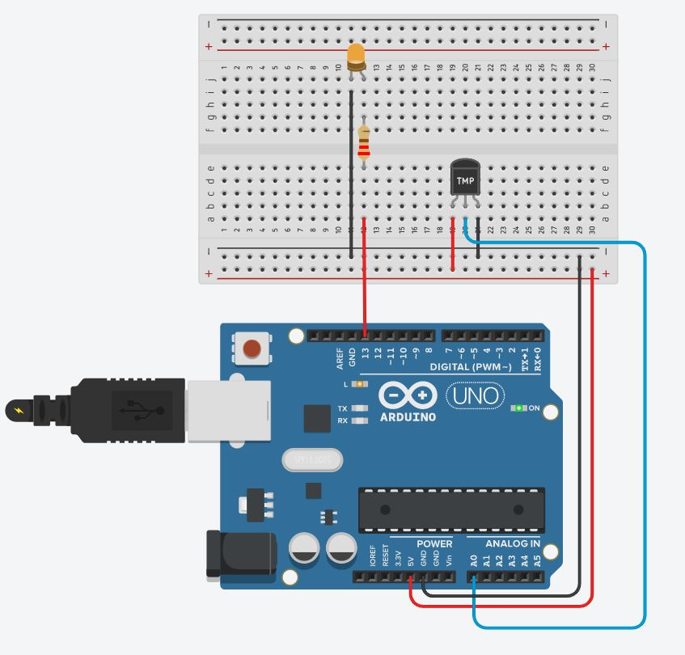

# **[¡Esto está que arde!](https://immune.hackrocks.com/challenges/start/esto-esta-que-arde)**

| 35 Points | EASY |
|---|---|

## **Summary**
¡Los hackers se han cargado el sistema de alarma por sobrecalentamiento de la GamerDream, la consola insignia de VR Electronics! Por el bien de todas las consolas que funcionen en Sevilla durante el mes de agosto, ¡tenemos que solucionarlo!

## In this challenge:
- Electrónica
- Arduino
- C++

---

El sobrecalentamiento es uno de los principales problemas a tener en cuenta a la hora de diseñar cualquier sistema electrónico, y es crucial proteger a los sistemas de sus efectos para evitar daños o reducciones en el rendimiento.

Durante el ciberataque a VR Electronics, parte del malware fue descargado como una actualización en la mayoría de las consolas GamerDream que estaban conectadas a los servidores en ese momento. Tras evaluar el alcance de los daños, se observó que uno de los efectos del malware fue el de alterar el código que regula la detección de los sobrecalentamientos: La GamerDream contiene un Arduino 1 que dispone de un sensor de temperatura, que le permite monitorizar la temperatura interna, y está conectado a un led que se enciende cuando dicha temperatura supera los límites admisibles.

Parece que la línea del código que calcula la temperatura medida por el sensor a partir de la señal de voltaje que este emite ha sido borrada, y que esa es la causa de que el sistema no funcione. La persona que diseñó el sistema en el pasado ya no se encuentra en la empresa, pero revisando las notas que tomó durante el desarrollo del mismo encontramos estas anotaciones en las hojas de características del sensor:

---

### **Problema:**
Haciendo uso de la información presente en las anotaciones que hemos rescatado, trata de restaurar la línea de código que permite detectar sobrecalentamientos en la GamerDream.

_Notas adicionales: para debuguear el código debes utilizar el simulador de Tinkercard: https://www.tinkercad.com/_

_Iniciar sesión -> Iniciar sesión con Google -> Circuitos -> Crear nuevo circuito_

¡Es muy intuitivo! Realiza el montaje mostrado en la siguiente imagen:

Y en la pestaña de código, pega el código suministrado en **[overheatControl.cpp](overheatControl.cpp)**.

---

### **Solución:**
Introducir el valor de temperatura que se muestra en el Monitor en serie cuando se fija la temperatura ambiente en 25ºC (La temperatura ambiente se puede modificar haciendo click en el sensor de temperatura con la simulación iniciada, lo cual despliega un slider).