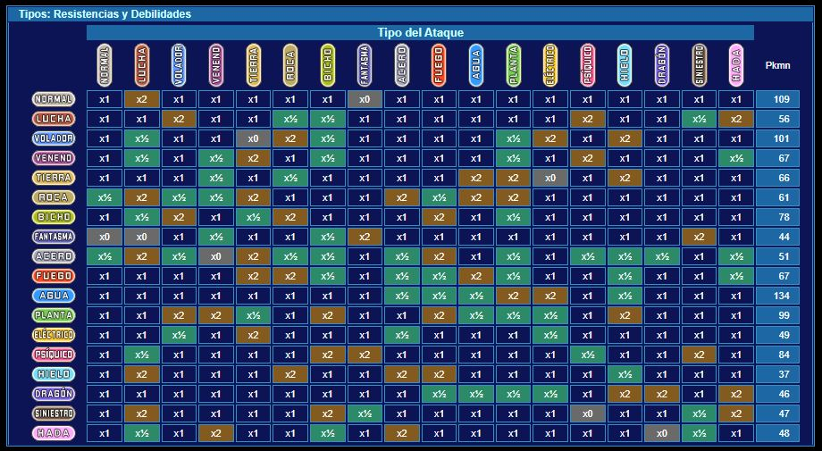

# **[¡Golpeando donde más duele!](https://immune.hackrocks.com/challenges/start/golpeando-donde-mas-duele)**

| 30 Points | EASY |
|-----------|------|

## Summary
¡El código de los juegos de Pokémon ha sido alterado! Los hackers se han cargado el sistema de cálculo de multiplicadores de daño por efectividad de los tipos; es decir, los ataques de, por ejemplo, tipo agua, ya no son eficaces contra Pokémon de tipo fuego. ¡¿En qué cabeza cabe?!, ¡Vamos a arreglar este estropicio!

## In this challenge:
- Python

---

Tras el ciberataque, testeando el estado de los videojuegos nos hemos percatado de que el cálculo de la efectividad de los ataques Pokémon… ¡ha sido borrado! Una de las principales mecánicas de los juegos de Pokémon consiste en jugar con la efectividad de unos tipos sobre otros para obtener una ventaja decisiva en los combates, por lo que hay que solucionarlo cuanto antes.

En la siguiente tabla, obtenida de la página web https://www.pokexperto.net/, se puede apreciar la tabla de multiplicadores por efectividad de los diferentes tipos de Pokémon.

Las columnas de la tabla indican el tipo del ataque realizado, y las filas indican el tipo del Pokémon que recibe dicho ataque.

De esta manera, si vamos, por ejemplo, a la _columna 9_ (la primera columna empezando por la izquierda es la columna 0), tenemos un ataque de **tipo Fuego**, y manteniéndonos en esa columna, bajamos hasta la _fila 11_ (la primera fila empezando por arriba es la fila 0), tenemos que el ataque es recibido por un Pokémon **tipo Planta**, por lo que el ataque es muy eficaz. Es por ello por lo que la posición (11, 9) de la tabla tiene un x2, porque un ataque **tipo Fuego** verá su daño multiplicado por 2 contra un Pokémon **tipo Planta**.

También hay que tener en cuenta que los Pokémon pueden tener hasta dos tipos: si el Pokémon que recibe el ataque **tipo Fuego** fuese de los **tipos Planta y Bicho**, de acuerdo con la tabla, ambos tipos reciben el doble de daño de dichos ataques, por lo que el multiplicador sería 2 x 2 = 4. Si, en cambio, el Pokémon receptor fuese de los tipos Planta y Agua, de acuerdo con la tabla, el multiplicador sería 2 x ½ = 1.

---

### **Situación inicial:**
Se dispone del script **[damageMultiplierCalculator.py](damageMultiplierCalculator.py)**, el cual contiene un array con todos los tipos de Pokémon, y la tabla de multiplicadores por efectividad entre tipos suministrada en este enunciado codificada en forma de matriz, construida como un array de arrays. Tanto el orden de los tipos dentro del array de tipos como los elementos de las columnas y filas de la matriz coinciden con la tabla de tipos suministrada.

El código solicita al usuario como entrada el tipo del ataque realizado, y los dos tipos del Pokémon que recibe dicho ataque, todo ello seguido y separado por comas, sin espacios, de la forma:

_TipoAtaque,TipoPkmn1,TipoPkmn2_

El Pokémon que recibe el ataque puede ser de un solo tipo, en cuyo caso la entrada sería:

_TipoAtaque,TipoPkm1_

La función [`computeDamageMultiplier`](damageMultiplierCalculator.py#L44) recoge los tipos del ataque y del Pokémon que lo recibe, y como se ha explicado en el enunciado, calcula el multiplicador de daño que se aplicará. **Dicha función, por desgracia, es la que ha sido borrada casi al completo.**

---

### **Problema:**
Completa la función [`computeDamageMultiplier`](damageMultiplierCalculator.py#L44), de manera que funcione correctamente. La solución a este reto consiste en el propio script **[damageMultiplierCalculator.py](damageMultiplierCalculator.py)**, con la función arreglada para que el script funcione correctamente.

Dispones también del archivo **[Examples.txt](Examples.txt)**, en el que puedes ver ejemplos de entradas y sus correspondientes salidas correctas (en la primera fila se muestra una entrada, en la segunda, su salida correcta, en la tercera fila, otra entrada, en la cuarta fila, su salida correcta, etc.…)

¡Buena suerte con el reto!