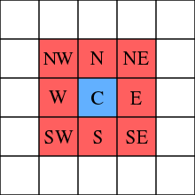
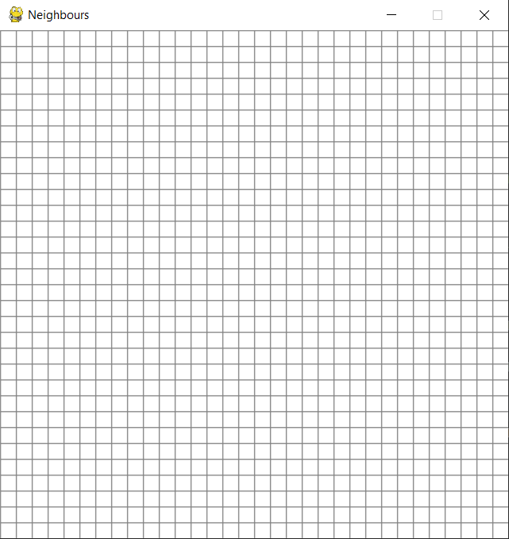
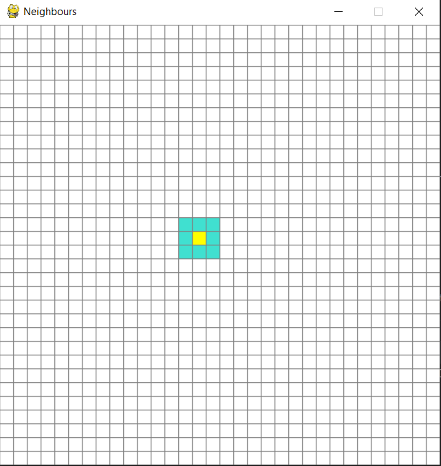

# **[Conociendo al Vecindario](https://immune.hackrocks.com/challenges/start/conociendo-al-vecindario)**

| 90 Points | HARD |
|-----------|------|

## Summary
Otro de los juegos afectados por el ciberataque fue el “Age of Empires”. Concretamente, el algoritmo de planificación que permite a las unidades moverse a la posición indicada por el jugador. ¿Cómo va a conquistar el mundo tu civilización si sus soldados no pueden ni siquiera avanzar un paso? Si queremos que nuestra civilización pase a la historia, ¡Debemos hacer algo!

## In this challenge:
- Python
- Planificación

---

En juegos de estrategia en tiempo real como el Age of Empires es muy común la codificación del mapa de juego como un grafo, sobre el que se realizan algoritmos de planificación para determinar el camino más corto que deben seguir las unidades para ir del punto A al punto B.

El mapa del juego bidimensional es dividido en celdas, que vendrían a ser los nodos del grafo, mientras que las aristas entre los nodos se establecen entre celdas contiguas en el mapa. Se determina la celda que ocupa la unidad, y la que clika el usuario con el ratón, y mediante un algoritmo de pathfinding como el A* se estima el camino más corto.

(El funcionamiento de estos algoritmos puede visualizarse en este sitio web: https://qiao.github.io/PathFinding.js/visual/ Se invita también al concursante a investigar acerca de teoría de grafos).

Uno de los pasos clave en el desarrollo de un algoritmo de pathfinding sobre un mapa de celdas es la determinación de la vecindad de una celda dada.

La vecindad de una celda consiste en las celdas que rodean a esta, y puede ser de varios tipos. Una vecindad a 8 considera vecinos a todas las celdas contiguas a una celda dada tanto lateral como diagonalmente, como se muestra en esta figura:

Tus compañeros del departamento de desarrollo de videojuegos han estado trabajando en un script que implementa una clase en Python para representar las celdas del mapa, y te han pedido que añadas a dicha clase un método que actualice los vecinos de una celda dada.

---

### **Situación inicial:**
Se suministra el script **[computeNeighborhood.py](computeNeighborhood.py)**. Dicho script incluye la declaración de la clase [`Cell`](computeNeighborhood.py#L7), que sirve para representar las celdas dentro del mapa de celdas. Tras la declaración de la clase [`Cell`](computeNeighborhood.py#L8), se crea un mapa de celdas, denominado [`grid`](computeNeighborhood.py#L18), que no deja de ser un array de arrays con el que se representa una matriz de celdas, que simboliza el mapa de celdas 2D. Al principio del script hay una variable llamada [`CELLS_PER_SIDE`](computeNeighborhood.py#L3) que determina el numero de celdas por lado del mapa 2D, que es un cuadrado.

Por tanto, el mapa 2D que representa la variable grid sería el mostrado en esta imagen:

Dentro de este mapa de celdas, las columnas van numeradas de la 0 a la 31 de izquierda a derecha, y las filas de la 0 a la 31 de arriba abajo, de manera que, por ejemplo, la celda superior izquierda sería la celda 0,0.
Al ejecutar el script, este pide al usuario como entrada la posición de una celda, que se introduce de la forma "fila,columna”.

Ejemplo: “_14,15_”.

El script devuelve por consola una lista de las celdas vecinas de la celda indicada por el usuario, que conforman su vecindario, y que en este caso serían:

_[[13, 15], [13, 16], [14, 16], [15, 16], [15, 15], [15, 14], [14, 14], [13, 14]]_

Al final del script hay una sección dedicada a la visualización del resultado, que **no debe ser considerada para la resolución del reto, y de hecho, debe ser comentada o eliminada cuando se suba el script como solución.**

De acuerdo a dicha visualización, el resultado anteriormente comentado se vería:

---

### **Problema:**
Todo esto que se acaba de relatar sería muy bonito si no fuese porque la clase [`Cell`](computeNeighborhood.py#L7) no dispone aun del método [`updateNeighbors`](computeNeighborhood.py#L14) que permite calcular los vecinos de la celda introducida. Tu misión es implementar dicho método, para que, una vez introducida una celda, la función permita calcular cuales son sus celdas vecinas, con vecindad a 8.

---

### **Solución:**
La solución a este reto consiste en el propio script **[computeNeighborhood.py](computeNeighborhood.py)**, arreglado para funcionar correctamente.

Dispones también del archivo **[Examples.txt](Examples.txt)**, en el que puedes ver ejemplos de entradas y sus correspondientes salidas correctas (En la primera fila se muestra una entrada, en la segunda, su salida correcta, en la tercera fila, otra entrada, en la cuarta fila, su salida correcta, etc.…)

¡Buena suerte con el reto!

---

## **IMPORTANTE:**
Se ha añadido al script **[computeNeighborhood.py](computeNeighborhood.py)** una sección llamada _[visualization](computeNeighborhood.py#L40)_, que permite visualizar gráficamente el resultado del algoritmo. Esta sección ha sido añadida para facilitar la depuración del código a los concursantes, pero para entregar el script como solución para el reto, dicha sección debe ser comentada o eliminada.