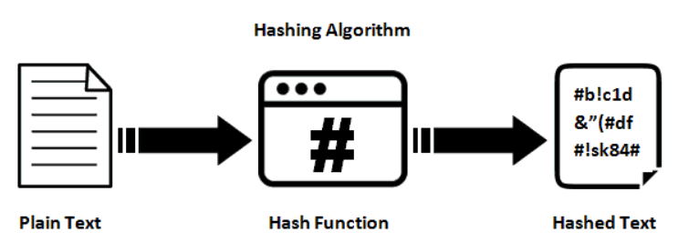

# **[Adivina Adivinanza](https://immune.hackrocks.com/challenges/start/adivina-adivinanza)**

| 65 Points | MEDIUM |
|-----------|--------|

## Summary
Entre algunas de las medidas que VR Electronics está tomando para prevenir posibles futuros ciberataques, se encuentra la de obligar tanto a los empleados de la compañía como a los usuarios de la plataforma a utilizar contraseñas lo suficientemente complejas como para soportar un ataque de fuerza bruta. Pero… ¿qué es un ataque de fuerza bruta?

## In this challenge:
- Python
- Hacking

---

Normalmente, los servidores como el de VR Electronics no almacenan las contraseñas como texto plano (por ejemplo, “BadBunny666”), sino que las almacenan “hasheadas” (el ejemplo anterior hasheado con la función de hash “sha1” sería: “bfd54208a77fbe9fca54bd589887dcd9f12005a4”).

Una función de hash es una operación que toma un texto plano de entrada y lo transforma en un hash, que es un conjunto de caracteres sin sentido, de la misma longitud independientemente de la entrada, y lo más importante, una vez un texto ha sido hasheado, no existe operación inversa para recuperar su contenido original.

Parece que, con este método, aunque un ciberdelincuente se haga con los datos de algún servidor, no puede obtener tu contraseña de ninguna manera… ¿verdad? Pues casi, pero hecha la ley, hecha la trampa. Durante años de filtraciones de contraseñas, circulan por la red listados con miles y miles de las contraseñas más frecuentes filtradas hasta la fecha. Esto da pie a los ataques de fuerza bruta:
El ciberdelincuente, una vez ha extraído una contraseña hasehada, la compara con todas y cada una de las contraseñas de alguna de esas listas de contraseñas más habituales, que él mismo se encarga de hashear también para poder realizar la comparación. Si has tenido la mala pata de utilizar una contraseña excesivamente sencilla, como “1234” o “contraseña”, el probable que esté en la lista, y, por tanto, el ciberdelincuente será capaz de recuperarla.

Como ingeniero de ciberseguridad de VR Electronics, te piden realizar un código que permita realizar un ataque de fuerza bruta sobre una contraseña hasheada, para utilizarlo como método de verificación de que las contraseñas de nuestros empleados son aceptablemente seguras.

---

### **Situación inicial:**
Se parte de un script **[crackPassword.py](crackPassword.py)** que tiene implementada una función que permite hashear una contraseña utilizando la función de hasheo "sha1", así como de la variable [`stolenPassword_hashed`](crackPassword.py#L10), que contiene una contraseña hasheada de uno de nuestros empleados más insensatos. También se dispone de una lista de miles de contraseñas habituales: **rockyou.txt***.

\* Debido al gran tamaño del archivo **rockyou.txt** original, se encuentra en tres fragmentos en la carpeta **[rockyou](rockyou/)**

---

### **Problema:**
Desarrolla el script suministrado, haciendo uso de las herramientas de las que partes, para recuperar la contraseña original correspondiente a la contraseña hasheada contenida en la variable [`stolenPassword_hashed`](crackPassword.py#L10), haciendo uso de la lista de contraseñas más habituales.

En el archivo **[Examples.txt](Examples.txt)**, puedes encontrar ejemplos de contraseñas hasheadas, y la contraseña original que deberías obtener si aplicas tu algoritmo a dichos hashes.

---

### **Solución:**
La solución a este reto es la contraseña original sin hashear correspondiente a [`stolenPassword_hashed`](crackPassword.py#L10).

¡Buena suerte con el reto!