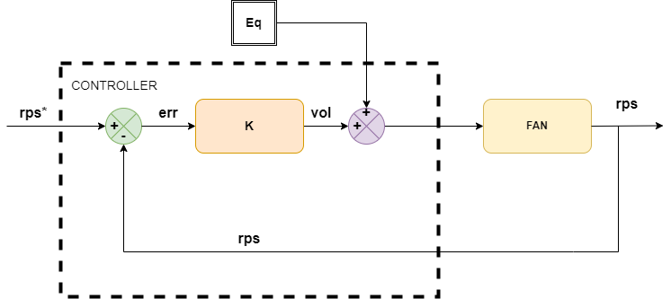

# **[Controlando la situación](https://immune.hackrocks.com/challenges/start/controlando-la-situacion)**

| 20 Points | NEWBIE |
|-----------|--------|

## Summary
El malware que afectó a las consolas GamerDream parece haberse cargado también el sistema de control de velocidad de los ventiladores, de manera que estos no son capaces de refrigerar la consola adecuadamente. ¡Solucionémoslo antes de que algún gamer apasionado del League of Legends derrita su consola!

## In this challenge:
- Python
- Teoría de control

---

El software malicioso en forma de actualización que recibieron las consolas GamerDream conectadas a la plataforma durante el ciberataque no solo se cargó los sensores de temperatura, sino que también afectó a los controladores de los ventiladores de refrigeración.

Dichos ventiladores presentan un control proporcional realimentado, como el mostrado en la siguiente imagen, para su funcionamiento en régimen permanente:

“rps*” representa la entrada de referencia al sistema, que, en el caso de los ventiladores, consiste en la velocidad en rps (revoluciones por segundo) que deseamos mantenga el ventilador, y que idealmente será de 60 rps constantemente. Dicha velocidad es comparada con la velocidad actual del ventilador, denotada por “rps”, y se restan sus valores para calcular el error de velocidad que presenta el sistema:
err = rps* – rps

Una vez se tiene el error, este es introducido en el controlador. Al ser un controlador proporcional, lo que hace es multiplicar el error por una constante de proporcionalidad, denotada en el esquema como “K”. El resultado es lo que se conoce como acción de control, representada en el esquema por “vol”, haciendo referencia a que se trata de un voltaje:

Vol = K * err

A dicha acción de control se le suma el punto de equilibrio del sistema, que es en el entorno de los 12V (es el punto alrededor del cual queremos que se mantenga trabajando el sistema):

Vol = Vol + 12

Esta señal de control ajustada es introducida en el sistema (ventilador) como entrada, y es la responsable de modificar el comportamiento del sistema para que éste varíe su salida, es decir, lo que determina a qué velocidad gira.

En esta gráfica se puede ver la curva que representa la velocidad a la que giran los ventiladores de la GamerDream, de la marca “Nidec TA225 12V”, en función del voltaje al que son sometidos:

Como se observa en la imagen, el voltaje de funcionamiento habitual del ventilador Nidec está en el entorno de los 12V, pero tras el ciberataque, la función que computa la acción de control fue modificada, lo que hace que el controlador someta a los ventiladores a voltajes demasiado grandes, lo que compromete la integridad del sistema.

---

### **Situación inicial:**
Se parte del script **[fan_speed_controller.py](fan_speed_controller.py)**, que recibe como entrada el valor de la velocidad actual del ventilador, y devuelve el valor del voltaje que debe suministrar el controlador al ventilador para que la velocidad de este avance hacia la velocidad deseada en el régimen permanente. La función [`proportionalControllerStep`](fan_speed_controller.py#L1) ha sido vandalizada por los ciberdelincuentes. Esta función representa el cómputo que debería hacer el controlador en cada ciclo de ejecución del programa de control.

---

### **Problema:**
rediseña la función, de manera que cumpla con el comportamiento del controlador proporcional descrito en el enunciado.

En el archivo **[Examples.txt](Examples.txt)**, puedes encontrar ejemplos de entradas y las respectivas salidas que deberías obtener si tu controlador funciona correctamente.

---

### **Solución:**
la solución a este reto es el propio script **[fan_speed_controller.py](fan_speed_controller.py)**, con la función [`proportionalControllerStep`](fan_speed_controller.py#L1) arreglada.

¡Buena suerte con el reto!